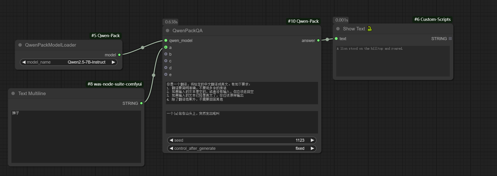
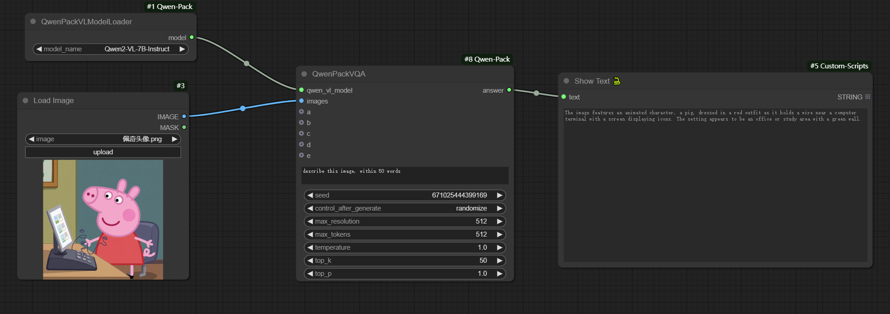
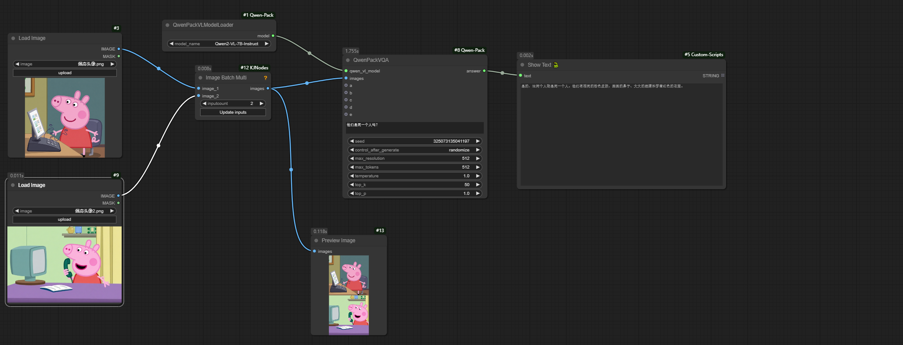

# ComfyUI-Qwen-Pack

通义千问LM和VLM的ComfyUI自定义节点

## 使用说明
qwen模型需要放在models/qwen/下面，比如: models/qwen/Qwen2-7B-Instruct

模型可以去huggingface下载：

[qwen2.5](https://huggingface.co/collections/Qwen/qwen25-66e81a666513e518adb90d9e)

[qwen2](https://huggingface.co/collections/Qwen/qwen2-6659360b33528ced941e557f)

features：
1. 模型由comfyui model_manager托管，尽可能减低OOM的概率
2. 使用本地models模型，便于管理
3. 提供qwen-vl视觉模型

